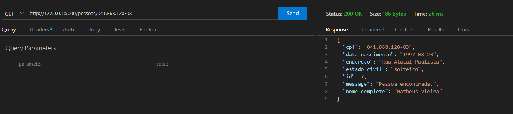

# Desafio Back-End: Api em Python Usando Flask para realizar operações CRUD com funcionários de uma empresa.


### Contexto!

Você está atuando como estagiário em uma empresa de tecnologia que está desenvolvendo uma API simples para cadastro e gestão de pessoas. O projeto surgiu em resposta a uma solicitação específica do cliente, que busca uma aplicação capaz de cadastrar informações básicas sobre funcionários e realizar operações de consulta, atualização e exclusão desses registros. A API será construída em Python, utilizando o framework de escolha do desenvolvedor (FastAPI, Flask, Django, etc.).

# Índice

- [Contexto](#contexto)
- [Passo a Passo para Executar a Aplicação Localmente](#passo-a-passo-para-executar-a-aplicacao-localmente)
- [O que foi feito?](#o-que-foi-feito)
- [Documentação da API](#documentacao-da-api)
- [Imagens Demonstrativas](#imagens-demonstrativas)

# Passo a Passo para Executar a Aplicação Localmente:

### Pré-requisitos:
1. Certifique-se de ter o Python instalado em sua máquina. Você pode baixá-lo em [python.org](https://www.python.org/downloads/).
2. Instale o gerenciador de pacotes pip, que geralmente é incluído com a instalação do Python.

### Passos:

#### 1. Clone o Repositório:

#### 2. Acesse o Diretório do Projeto:
```bash
cd diretório-clonado
```

#### 3. Instale as Dependências:
```bash
pip install -r requirements.txt
```

#### 4. Execute a Aplicação:
```bash
flask run 
```

#### 5. Teste as Funcionalidades:
Abra um navegador e acesse a url abaixo: (ou outra porta configurada).

```bash
http://localhost:5000/teste
```

Essa rota irá abrir uma página html criada por mim que permitirá que você teste a aplicação. 

Você também pode utilizar ferramentas como curl ou Postman para testar as operações/rotas de CRUD que serão listadas abaixo.

#### 6. Documentação:
Uma documentação com todas as rotas da api foi criada, e você pode utiliza-la para saber o que deve ter em cada requisição.

Você encontra uma descrição de todas as rotas nas próximas sessões desse readme.

Além disso, eu criei no servidor uma página html que contem a documentação da api, ela pode ser acessada na rota:

```bash
http://localhost:5000/documentacao
```

Observe que o servidor precisa estar ativo para a url funcionar.


#### 7. Testes automatizados:

Eu também criei alguns testes automatizados para as principais rotas.

Para rodar os testes, você pode executar os comandos abaixo dentro do diretório do projeto:

Testar rota de cadastrar novo usuário:

```bash
python -m unittest ./app/tests/test_cadastrar.py
```

Testar rotas que modificam os usuários:

```bash
python -m unittest ./app/tests/test_editar.py
```

Testar rotas que listam os usuários e deletam os usuários:

```bash
python -m unittest ./app/tests/test_get_delete.py
```


# O que foi feito?

## 1. Defini as rotas e a arquitetura

Decidi criar 8 endpoints que serão listas na documentação no final desse readme. Além disso, escolhi usar a arquitetura MVC(Model, View Controller).

As rotas foram definidas dentro do view, sendo as rotas da api dentro do arquivo "pessoa_view.py":


## 2. Implementei a lógica para armazenar dados utilizando uma database

Para armazenar as informações resolvi utilizar o SQLAlchemy com o banco de dados SQLite.

O SQLAlchemy é um ORM (Object-Relational Mapper) para Python. Ele fornece uma abstração sobre bancos de dados relacionais, permitindo que você interaja com o banco de dados usando objetos Python em vez de escrever diretamente em SQL.

Eu criei uma classe "Pessoa" que representa a minha entidade. Essa classe herda a classe "Model" fornecida pelo SQLAlchemy indicando que é uma classe que representa o banco de dados.


## 3. Validação de dados

Validei vários dos dados recebidos para garantir a segurança da aplicação. Fazendo o processo de validação e sanitização.


## 4. Operações de CRUD (Create, Read, Update, Delete):

Eu criei as 4 operações principais de uma API (Create, Read, Update e Delete) e fiz isso através de 8 endpoints:

- http://127.0.0.1:5000/pessoas/adicionar (POST) => Cadastrar uma nova pessoa
- http://127.0.0.1:5000/pessoas/edit/id/<int:pessoa_id> (PUT) => Atualizar Pessoa por ID
- http://127.0.0.1:5000/pessoas/edit/cpf/<string:pessoa_cpf> (PUT) => Atualizar Pessoa por CPF
- http://127.0.0.1:5000/pessoas (GET) => Listar Pessoas
- http://127.0.0.1:5000/pessoas/<string:cpf> (GET) => Obter Pessoa por CPF
- http://127.0.0.1:5000/pessoas/id/<int:pessoa_id> (GET) => Obter Pessoa por ID
- http://127.0.0.1:5000/pessoas/delete/id/<int:pessoa_id> (DELETE) => Deletar Pessoa por ID
- http://127.0.0.1:5000/pessoas/delete/cpf/<string:cpf> (DELETE) => Deletar Pessoa por CPF




## 5. Páginas html.

Foi criado duas páginas htmls estáticas dentro do servidor da api para ajudar o usuário a testar a aplicação da melhor maneira possível:

- http://127.0.0.1:5000/teste => Página html que permite fazer requisições para todas as rotas (use para testar).
- http://127.0.0.1:5000/documentacao => Documentação de todas as rotas do servidor.


## 6. Testes Automatizados.

Eu também criei testes automatizados para testar algumas das principais rotas:


# Documentação da API

## 1. Cadastrar Pessoa

### Rota
- **POST** `/pessoas/adicionar`

#### Descrição
Cadastra uma nova pessoa.

#### Parâmetros no Corpo da Requisição
- `nome_completo` (string): Nome completo da pessoa.
- `data_nascimento` (string): Data de nascimento no formato "YYYY-MM-DD".
- `endereco` (string): Endereço da pessoa.
- `cpf` (string): CPF da pessoa. O cpf deve serguir o seguinte padrão "000.000.000-00"
- `estado_civil` (string): Estado civil da pessoa.

#### Resposta
- Código 201 (Created) em caso de sucesso, com os dados da pessoa cadastrada.
- Código 400 (Bad Request) em caso de campos obrigatórios ausentes ou inválidos.
- Código 500 (Internal Server Error) em caso de erro interno no servidor.

## 2. Atualizar Pessoa por ID

### Rota
- **PUT** `/pessoas/edit/id/<int:pessoa_id>`

#### Descrição
Atualiza os dados de uma pessoa com base no ID.

#### Parâmetros no Corpo da Requisição
- `campo` (string): Nome do campo a ser atualizado.
- `novo_valor` (string): Novo valor para o campo especificado.

#### Resposta
- Código 200 (OK) em caso de sucesso, com os dados atualizados da pessoa.
- Código 400 (Bad Request) em caso de campos ausentes ou inválidos.
- Código 404 (Not Found) se a pessoa com o ID especificado não for encontrada.
- Código 500 (Internal Server Error) em caso de erro interno no servidor.

## 3. Atualizar Pessoa por CPF

### Rota
- **PUT** `/pessoas/edit/cpf/<string:pessoa_cpf>`

#### Descrição
Atualiza os dados de uma pessoa com base no CPF. O cpf deve serguir o seguinte padrão "000.000.000-00".

#### Parâmetros no Corpo da Requisição
- `campo` (string): Nome do campo a ser atualizado.
- `novo_valor` (string): Novo valor para o campo especificado.

#### Resposta
- Código 200 (OK) em caso de sucesso, com os dados atualizados da pessoa.
- Código 400 (Bad Request) em caso de campos ausentes ou inválidos.
- Código 404 (Not Found) se a pessoa com o CPF especificado não for encontrada.
- Código 500 (Internal Server Error) em caso de erro interno no servidor.

## 4. Listar Pessoas

### Rota
- **GET** `/pessoas`

#### Descrição
Lista todas as pessoas cadastradas.

#### Resposta
- Código 200 (OK) em caso de sucesso, com a lista de pessoas cadastradas.
- Código 500 (Internal Server Error) em caso de erro interno no servidor.

## 5. Obter Pessoa por CPF

### Rota
- **GET** `/pessoas/<string:cpf>`

#### Descrição
Obtém os dados de uma pessoa com base no CPF. O cpf deve serguir o seguinte padrão "000.000.000-00".

#### Parâmetros
- Método: GET
- Caminho: `/pessoas/<string:cpf>`

#### Resposta
- Código 200 (OK) em caso de sucesso, com os dados da pessoa.
- Código 400 (Bad Request) se o CPF for inválido.
- Código 404 (Not Found) se a pessoa com o CPF especificado não for encontrada.
- Código 500 (Internal Server Error) em caso de erro interno no servidor.

## 6. Obter Pessoa por ID

### Rota
- **GET** `/pessoas/id/<int:pessoa_id>`

#### Descrição
Obtém os dados de uma pessoa com base no ID.

#### Resposta
- Código 200 (OK) em caso de sucesso, com os dados da pessoa.
- Código 404 (Not Found) se a pessoa com o ID especificado não for encontrada.
- Código 500 (Internal Server Error) em caso de erro interno no servidor.

## 7. Deletar Pessoa por ID

### Rota
- **DELETE** `/pessoas/delete/id/<int:pessoa_id>`

#### Descrição
Deleta uma pessoa com base no ID.

#### Resposta
- Código 200 (OK) em caso de sucesso, com mensagem de exclusão bem-sucedida.
- Código 404 (Not Found) se a pessoa com o ID especificado não for encontrada.
- Código 500 (Internal Server Error) em caso de erro interno no servidor.

## 8. Deletar Pessoa por CPF

### Rota
- **DELETE** `/pessoas/delete/cpf/<string:cpf>`

#### Descrição
Deleta uma pessoa com base no CPF. O cpf deve serguir o seguinte padrão "000.000.000-00".

#### Resposta
- Código 200 (OK) em caso de sucesso, com mensagem de exclusão bem-sucedida.
- Código 404 (Not Found) se a pessoa com o CPF especificado não for encontrada.
- Código 500 (Internal Server Error) em caso de erro interno no servidor.


# Imagens Demonstrativas


